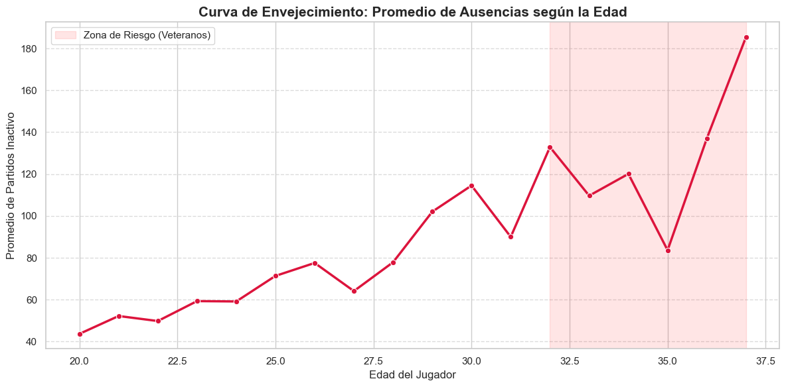
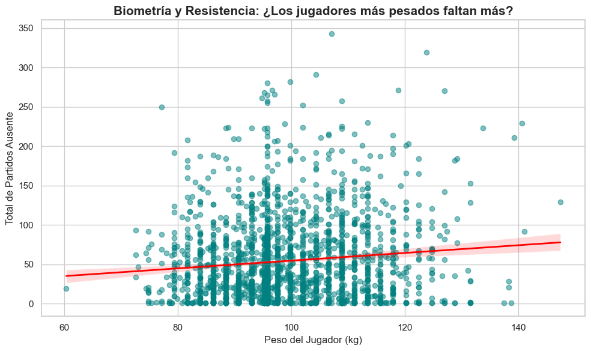
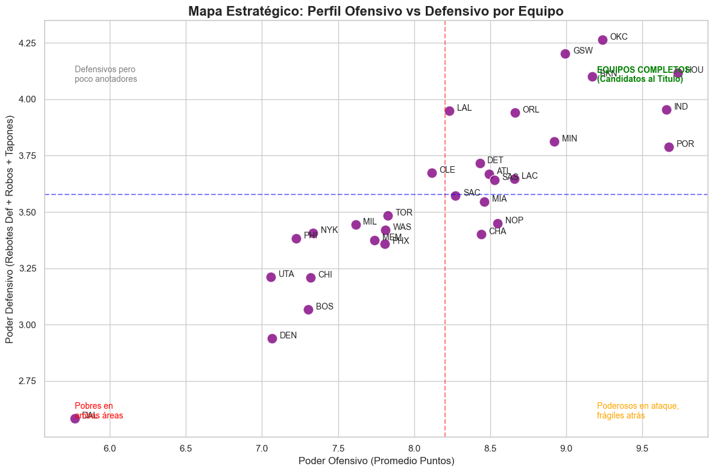
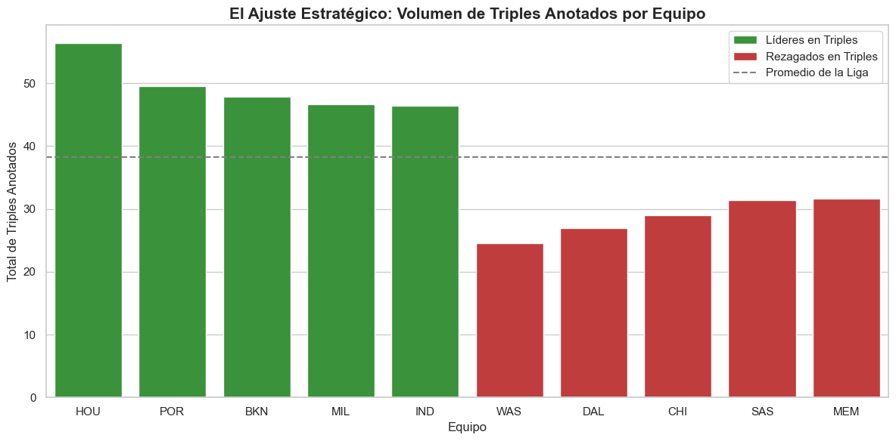
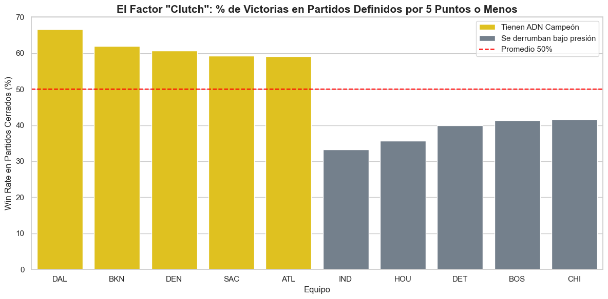
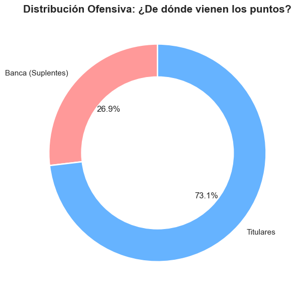
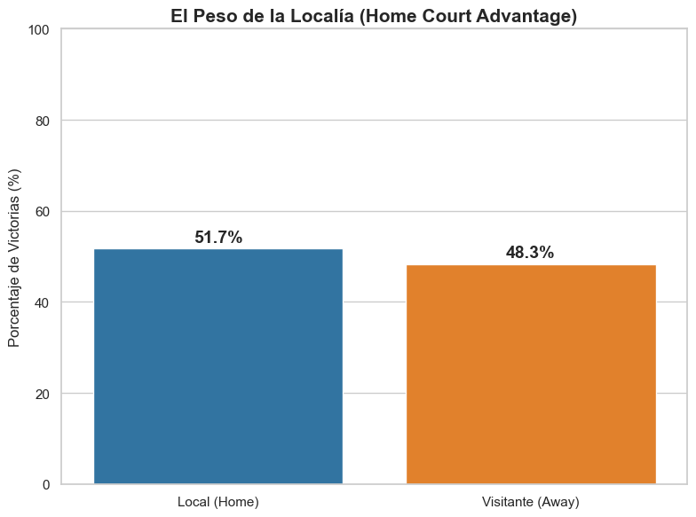
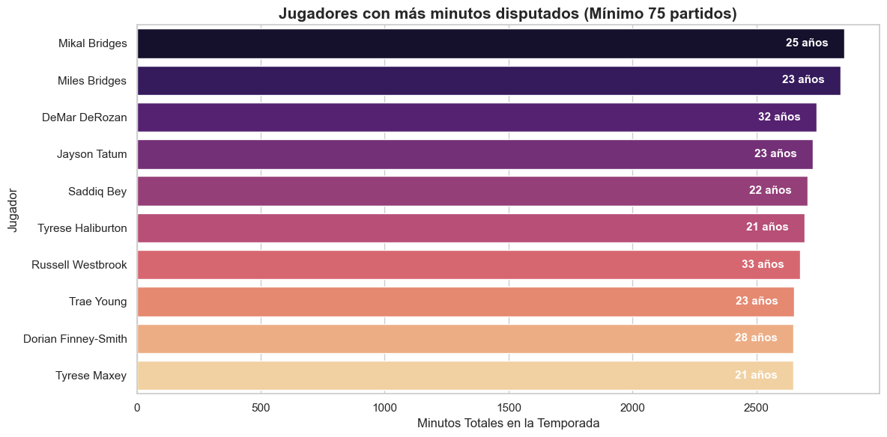
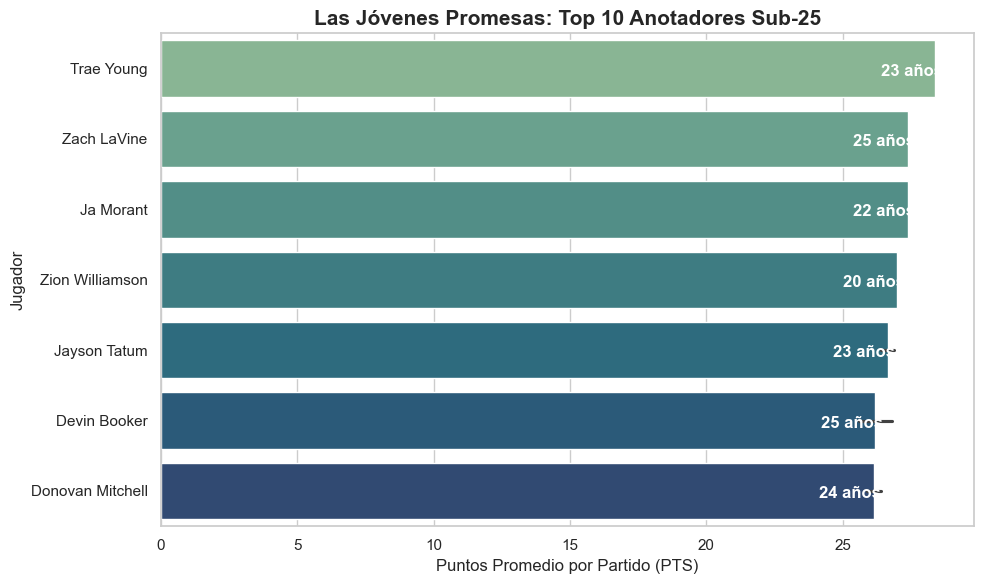

  

---

##  Introducción y Propósito

El presente proyecto surge de la necesidad de comprender cómo ha evolucionado el baloncesto profesional de la NBA en las últimas temporadas, centrándose en la transformación táctica de las franquicias y el peso real de los jugadores de élite en el éxito de sus equipos.

El propósito es transformar datos crudos provenientes de competiciones oficiales en insights estratégicos que permitan identificar patrones de victoria, riesgos físicos asociados a variables biométricas y tendencias del mercado global deportivo.

---

##  Objetivos del Proyecto

-  Analizar el impacto de los jugadores estrella.
-  Evaluar la evolución táctica del juego (revolución del triple).
-  Identificar riesgos de salud relacionados con edad y peso.
-  Detectar patrones estructurales en el rendimiento de franquicias.

---

##  Arquitectura de Datos

###  Proceso ETL

1. Extracción de datos desde archivos CSV (Kaggle).
2. Limpieza y normalización de variables.
3. Modelado relacional en SQL Server.
4. Validación de integridad y consistencia.

###  Escalabilidad

El modelo fue diseñado considerando una futura migración a entorno cloud (Azure), permitiendo procesamiento distribuido y consumo eficiente en herramientas de visualización.

---

##  Análisis Exploratorio de Datos (EDA)

---

### Curva de Envejecimiento y Riesgo

  

**Descripción:**  
El gráfico evidencia el incremento progresivo de ausencias por partido a partir de los 32 años, marcando una clara zona de riesgo en jugadores veteranos.
La disponibilidad física cae de manera significativa después de los 30 años. Las franquicias deben gestionar estratégicamente la carga de minutos de jugadores veteranos para proteger su inversión y evitar deterioro acelerado.

---

### Peso vs. Resistencia

  

**Descripción:**  
El análisis de regresión muestra una tendencia positiva leve entre peso corporal y ausencias acumuladas. No obstante, la alta dispersión indica que el peso no es un predictor robusto de disponibilidad física. Esto sugiere que la gestión de carga y la edad podrían tener mayor impacto que la biometría aislada.

---

# Estrategia de las Franquicias

---

### Mapa Estratégico (Ofensivo vs. Defensivo)

  

**Descripción:**  
Clasifica a las franquicias en cuatro cuadrantes según promedio de puntos y eficiencia defensiva. 
Identifica a los “Equipos Completos” que dominan ambas áreas y se posicionan como verdaderos candidatos al título.  
Los equipos con alto poder ofensivo pero bajo rendimiento defensivo tienden a ser menos efectivos en instancias decisivas como playoffs.

---

### Ajuste del Triple

  

**Descripción:**  
Compara a los equipos líderes y rezagados en volumen de lanzamientos de triple. 
Confirma la consolidación de la “Revolución del Triple”.  
Las franquicias líderes muestran sistemas ofensivos más modernos y eficientes, mientras que los rezagados dependen de un juego más físico con menor retorno estadístico.

---

#  Impacto de las Estrellas y Factores de Victoria

---

### Factor Clutch

  

**Descripción:**  
Analiza el porcentaje de victorias en partidos definidos por cinco puntos o menos.
Diferencia equipos con “ADN Campeón” de aquellos que colapsan bajo presión.  
Un alto win rate en momentos cerrados suele correlacionarse con la presencia de una superestrella capaz de resolver posesiones críticas.

---

### Distribución Titulares vs. Suplentes

  

**Descripción:**  
Representa el porcentaje de puntos aportados por la banca respecto al total del equipo.  
Una alta dependencia de los titulares incrementa vulnerabilidad ante lesiones. La producción ofensiva está concentrada en los titulares, lo que puede representar un riesgo estructural si no existe una rotación sólida que sostenga el rendimiento.

---
### Peso de la Localía

  

**Descripción:**  
Compara el porcentaje de victorias en condición de local versus visitante. La ventaja de localía continúa siendo estadísticamente favorable, aunque su magnitud sugiere que el diferencial competitivo depende principalmente del rendimiento estructural del equipo más que del contexto geográfico. 
Esto refuerza la importancia estratégica de asegurar posiciones altas en temporada regular.

---
# Gestión de Activos (Jugadores)

---

### Top 10 

  

**Descripción:**  
Identifica jugadores con más de 75 partidos disputados y mayor volumen total de minutos. El volumen elevado de minutos combinado con alta disponibilidad identifica a los jugadores estructurales de cada franquicia. No obstante, una carga sostenida en perfiles veteranos podría representar riesgo de desgaste futuro, especialmente en equipos con baja profundidad de banca.
Son activos rentables de la liga: combinan rendimiento y durabilidad, pilares fundamentales para continuidad competitiva.

---
### Jóvenes Promesas

  

**Descripción:**  
Ranking de los 10 máximos anotadores menores de 25 años.  
Estos perfiles no solo representan producción ofensiva inmediata, sino también activos estratégicos que extienden la ventana competitiva de las franquicias y potencian su exito futuro.
Los equipos en reconstrucción dependen estratégicamente de estos perfiles para sostener su crecimiento a largo plazo.

---

### Conclusión
El análisis integral de las métricas ofensivas, defensivas y biométricas evidencia que el éxito en la NBA moderna no responde a un único factor aislado, sino a un equilibrio estructural entre rendimiento presente y sostenibilidad futura. El mapa estratégico confirma que los verdaderos contendientes combinan eficiencia ofensiva con solidez defensiva, mientras que la evolución del triple refleja una transformación táctica que redefine la competitividad. Sin embargo, el rendimiento colectivo también depende de variables menos visibles: la durabilidad de los jugadores, la gestión de la carga física y el impacto del envejecimiento, factores que determinan la estabilidad de una franquicia a lo largo del tiempo.

Asimismo, la concentración del scoring (capacidad de hacer puntos) en los titulares expone riesgos ante lesiones, lo que refuerza la importancia de una banca profunda para sostener el rendimiento. La ventaja de localía, aunque estadísticamente favorable, resulta complementaria frente a la estructura del equipo. En paralelo, la irrupción de jóvenes anotadores de élite señala una transición generacional que amplía ventanas competitivas cuando se combina con equilibrio táctico y gestión inteligente de activos. En conjunto, la evidencia sugiere que las franquicias más sostenibles son aquellas que integran datos de rendimiento, salud y proyección en una estrategia coherente de construcción deportiva.
